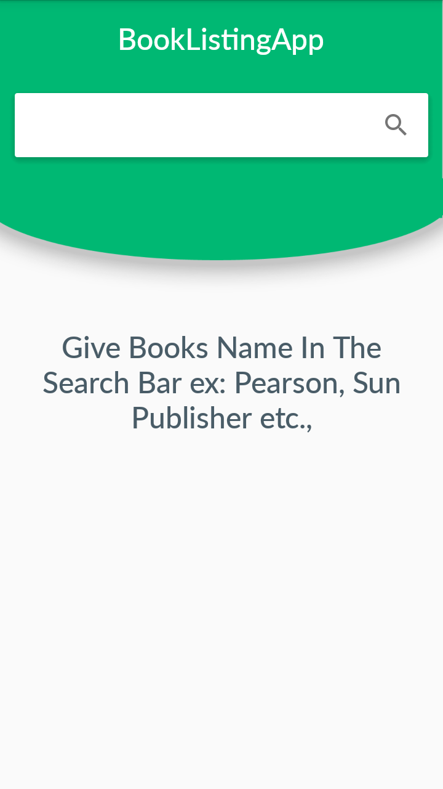
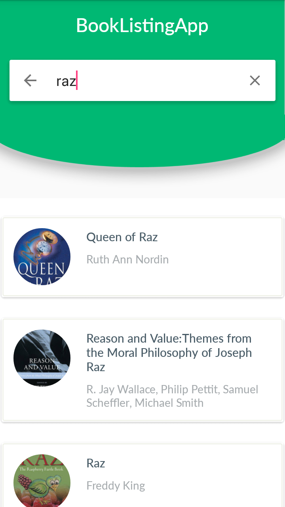

## BookListingApp
Project which comes under Udacity Android Basics Nanodegree Program

## Project Overview
The goal is to design and create the structure of a Book Listing app which would allow a user to get a list of published books on a given topic. You will be using the google books api in order to fetch results and display them to the user.

## Why this project?
I learned about the web and about how to get data from an api. I also learned how to parse that data and display it to a user. This project gives me the ability to practice those skills, which will be key in developing any app which makes use of a backend server, real time data, or interactions over the internet.

## What will I learn?
This project is about combining various ideas and skills we’ve been practicing throughout the course. They include:

1. Fetching data from an API
2. Using an AsyncTask
3. Parsing a JSON response
4. Creating a list based on that data and displaying it to the user.

## Requirements
To achieve this, I'll make use of the [Google Books API](https://developers.google.com/books/docs/v1/getting_started#intro). This is a well-maintained API which returns information in a JSON format.
An example query that we found useful was :

https://www.googleapis.com/books/v1/volumes?q=android&maxResults=1

## Final Output - Screenshots

Screen 1                          |Screen 2
:--------------------------------:|:--------------------------------:
  |

## Download
You can download the apk here [BookListingApp](../../raw/master/app/screenshots/app-debug.apk)
